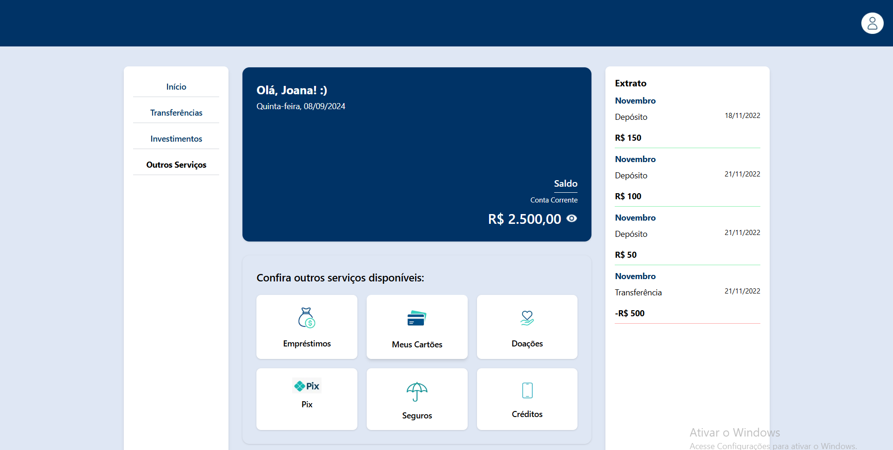

<h2>👋 Bem-vindo ao meu GitHub!</h2>

Sou um <strong>Desenvolvedor Front-End</strong> focado em criar interfaces modernas e experiências web marcantes.  Tenho paixão por tecnologia, design e tudo que envolve criar projetos interativos com código!

---

### 🚀 Tecnologias & Ferramentas

  
  
  
  
  
  

---

### 🌟 Projetos em Destaque

#### 🧱 Site Tributo ao 2Pac

   
  <strong>Site Tributo ao 2Pac</strong> 
  HTML | CSS | JavaScript

#### 💼 Portfólio Pessoal

   
  <strong>Meu Portfólio Pessoal</strong> 
  HTML | CSS | JavaScript

#### 💳 Sistema de Serviços Bancários

   
  <strong>Dashboard com Serviços Bancários</strong> 
  ReactJS | TailwindCSS | NodeJS

---

### 📫 Contato

  
  
  
  

---

✨ Vamos construir algo incrível juntos!

